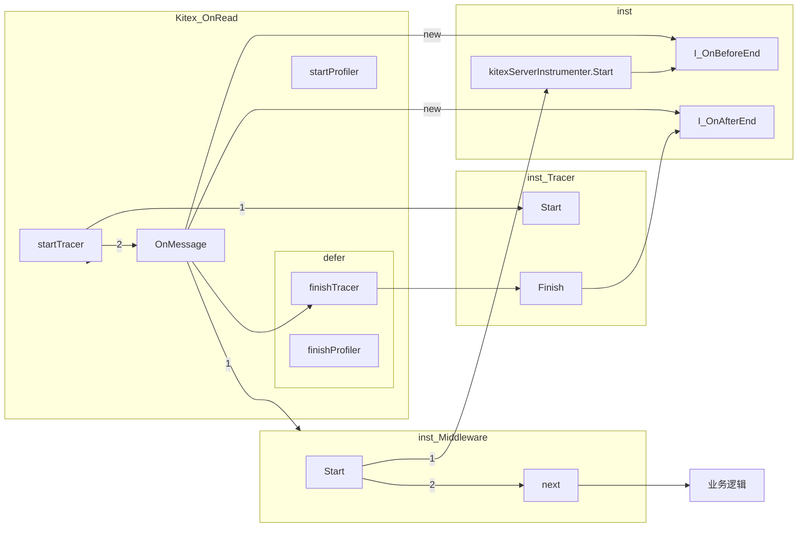

```mermaid


flowchart LR


subgraph inst
    I_ksi_start[kitexServerInstrumenter.Start]
    I_OnBeforeEnd
    I_OnAfterEnd
end

subgraph inst_Tracer
  Tra_Start[Start]
  Tra_Finish[Finish]
end

subgraph inst_Middleware
    M_M1[Start]
    M_M_next[next]
end

subgraph Kitex_OnRead
  K_startTracer[startTracer]
  K_startProfiler[startProfiler]
  K_OnMessage[OnMessage]
    subgraph Kitex_OnRead_defer[defer]
        K_finishTracer[finishTracer]
        K_finishProfler[finishProfiler]
    end
end

BUS_CODE["业务逻辑"]


Kitex_OnRead --> K_startTracer
K_startTracer --> |2|K_OnMessage
K_startTracer --> |1|Tra_Start
K_OnMessage --> |1|inst_Middleware
K_OnMessage --> K_finishTracer
K_finishTracer --> Tra_Finish
M_M1 --> |2|M_M_next
M_M1 --> |1|I_ksi_start
M_M_next --> BUS_CODE
I_ksi_start --> I_OnBeforeEnd
Tra_Finish --> I_OnAfterEnd

K_OnMessage --> |new|I_OnBeforeEnd
K_OnMessage --> |new|I_OnAfterEnd
```
  OnRead
//OnRead --> startTracer
